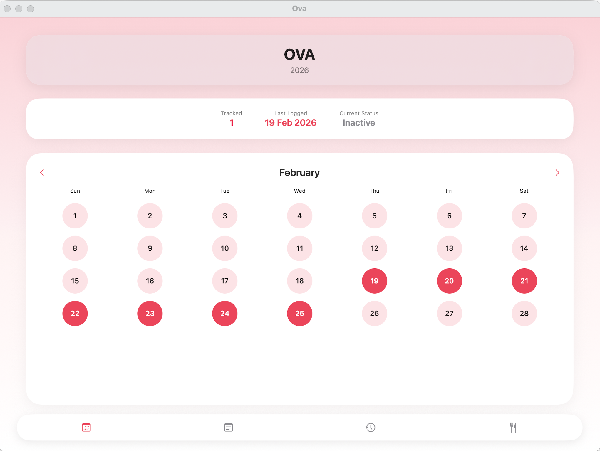
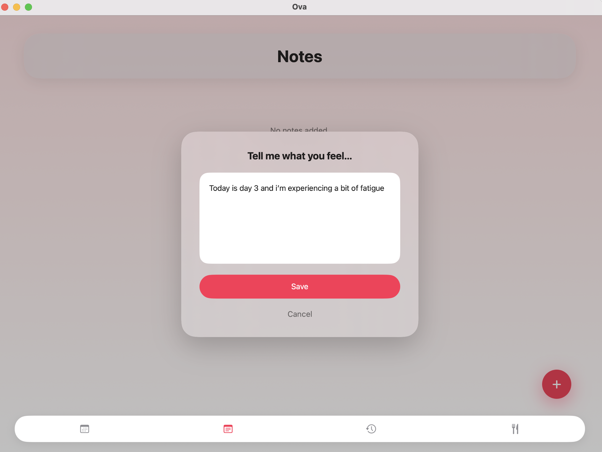
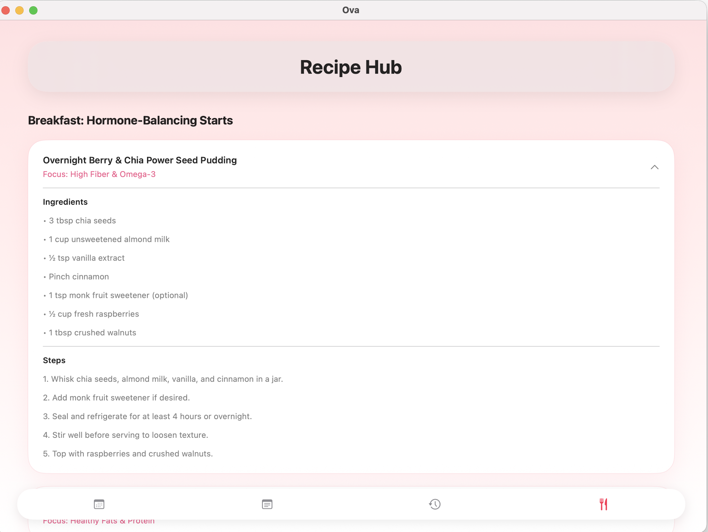

# Ova  

> A privacy-first, PCOD-friendly menstrual health app built using SwiftUI — for Swift Student Challenge 2026.

---

## About Ova  

Ova is a **fully offline iOS application** designed to make menstrual health tracking **flexible, private, and stress-free**.  

Unlike traditional apps that rely on predictions and rigid cycle patterns, Ova is built for **real users with real variations** — especially those with **irregular cycles such as PCOD/PCOS**.

---

## Why Ova?  

Most period tracking apps:  
- Assume a “perfect” 28-day cycle  
- Push predictions that may not be accurate  
- Require internet access  
- Track user data  

**Ova does things differently:**  
- No forced predictions  
- No data tracking  
- No internet required  
- Fully user-controlled experience  

---

## Features  

### Flexible Period Logging  
- Log cycles only when needed  
- No pressure to maintain streaks  
- Designed for irregular patterns  

### Personal Notes  
- Track symptoms, moods, or observations  
- Completely customizable  

### History View  
- View past entries clearly  
- Helps users identify patterns manually  

### Recipe Hub  
- Curated recipes for hormonal balance  
- Helpful for PCOD/PCOS lifestyle support  

---

## Tech Stack  

- **SwiftUI**  
- **Local Storage (Offline-first)**  
- **Pure iOS Development (No APIs / No third-party dependencies)**  

---

## Privacy First  

Ova is built with a strong focus on user privacy:  
- No internet usage  
- No cloud storage  
- No analytics or tracking  
- All data remains on-device  

---

## Screenshots  

### Home

### Notes

### Recipe Hub

---

## Impact  

Ova creates a **safe and inclusive space** for users who are often overlooked by mainstream period tracking apps.  

It empowers users to:  
- Track health without pressure  
- Embrace irregular cycles  
- Maintain complete control over their data  

---

## Developed For  

**SSC 2026 Submission**  
Built with a focus on **real-world usability, privacy, and inclusivity**.
